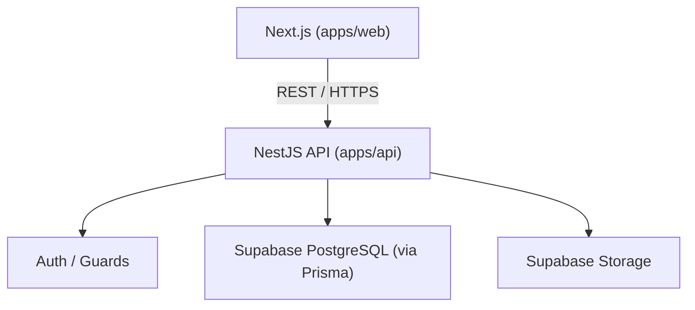

# Backend Architecture

**Status: not yet initialized.** `apps/api` is an empty placeholder. Everything on
this page describes the *planned* architecture — do not treat it as implemented.



## Stack

NestJS · TypeScript · REST API · Prisma (ORM) · Supabase (managed PostgreSQL +
Storage) · deployed on Railway.

## Ownership

NestJS owns: authentication, authorization, business logic, validation, database
operations, publishing workflows, content management, and media workflows. The
frontend never talks to PostgreSQL or Supabase directly — see
[Frontend Data Fetching](../frontend/data-fetching.md).

```text
Never:  Browser → PostgreSQL
Always: Next.js → NestJS API → PostgreSQL / Supabase
```

## Planned Modules

Auth/Users, Menu, Events, Regulars/Membership, Community, Products, Notifications,
Admin/CMS — see [Modules](modules.md).

## When This Gets Built

Backend implementation is a distinct phase after the frontend environment and the
SRS/design system are finalized — see [Development Workflow](../development/workflow.md).
Do not initialize NestJS, Prisma, or database configuration ahead of that phase
without explicit instruction.
