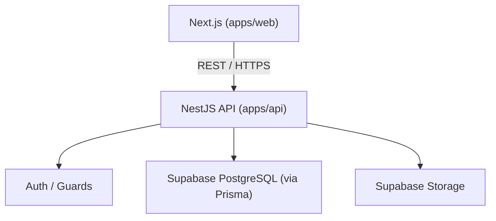

# Backend Architecture

**Status: Phase 1 (project setup) done.** `apps/api` is a bare NestJS app with
env validation, a Prisma-backed `DatabaseModule`, and a `GET /api/v1/health`
check — no Auth, Communities, Events, Media, or Audit modules yet. Everything else
on this page describes the *planned* architecture — do not treat it as implemented
until its own phase lands.



## Stack

NestJS · TypeScript · REST API · Prisma (ORM) · Supabase (managed PostgreSQL +
Storage) · deployed on Railway.

## Ownership

NestJS owns: authentication, authorization, business logic, validation, database
operations, publishing workflows, content management, and media workflows. The
frontend never talks to PostgreSQL or Supabase directly — see
[Frontend Data Fetching](../frontend/data-fetching.md).

```text
Never:  Browser → PostgreSQL
Always: Next.js → NestJS API → PostgreSQL / Supabase
```

## Planned Modules

Auth/Users, Menu, Events, Regulars/Membership, Community, Products, Notifications,
Admin/CMS — see [Modules](modules.md).

## When This Gets Built

Backend implementation started ahead of the frontend pages/UI phases on explicit
instruction — scoped initially to Communities + Events only (Menu, Products, and
Community Wall remain future work; see [Modules](modules.md)). See
[Development Workflow](../development/workflow.md) for the phase plan.
