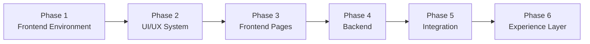

# Development Workflow

## Phases



| Phase | Covers | Status |
|---|---|---|
| 1. Frontend Environment | Next.js setup, architecture, tooling, env config | **Done** |
| 2. UI/UX System | Design tokens, typography, colours, base components | Not started |
| 3. Frontend Pages | Home, Menu, What's On, Regulars, Community, Products, Visit | Not started |
| 4. Backend | NestJS, PostgreSQL, Prisma, Auth, CMS, APIs | Not started |
| 5. Integration | Frontend ↔ API, membership, community uploads, events, products | Not started |
| 6. Experience Layer | Dedicated animations, moving creature, micro-interactions, perf | Not started |

This separation matters: the client wants animation limited to dedicated pages, with
no preloader (FR-UX-003/005) — the visual/animation layer must not leak into earlier
engineering phases.

## Package Manager

npm, via root workspaces (`apps/*`). Do not mix package managers or introduce lockfile
conflicts.

## Scripts

```bash
npm install
npm run dev --workspace=web
npm run build --workspace=web
npm run lint --workspace=web
```
