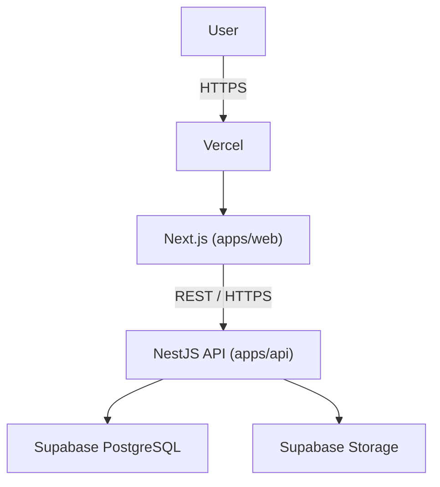

# Frontend Architecture

## Responsibility

Next.js owns: presentation, routing, rendering, SEO, frontend interaction, and API
consumption. It does **not** own business logic, authentication, or direct database
access — see [Backend Architecture](../backend/architecture.md).

## Stack

Next.js (App Router) · React · TypeScript · Tailwind CSS · ESLint. No state-management
library is installed — none is required yet; add one only against a concrete
requirement, not speculatively.

## Rendering Model

- **Server Components by default.**
- **Client Components** only where interaction genuinely requires them (`"use client"`
  at the leaf, not the page).
- No unnecessary client-side state.

## Current Status

Only the root route (`/`) exists, as a minimal placeholder. Feature routes (`/menu`,
`/whats-on`, `/community`, `/products`, `/visit`) are not yet built — see
[Sitemap](../project/sitemap.md) for the confirmed IA and
[Project Structure](project-structure.md) for where they will live.
