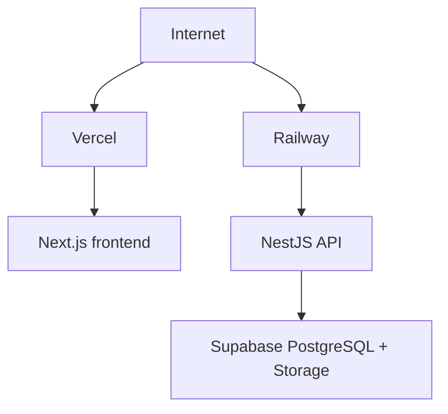

# Deployment

**Status: planned.** No deployment is configured yet.



| Component | Target |
|---|---|
| `apps/web` | Vercel |
| `apps/api` | Railway |
| Database + Storage | Supabase |

Suggested domains (subject to client confirmation):

```text
theaverageguy.in       → Next.js / Vercel
api.theaverageguy.in   → NestJS / Railway
```

## Before Launch (SRS §11)

- Confirm hosting, domain, SSL, backups, and analytics.
- Provide secure handover documentation and credentials process.
- Provide CMS guidance if a CMS is delivered.
- Record launch approval after UAT and defect resolution/acceptance.
