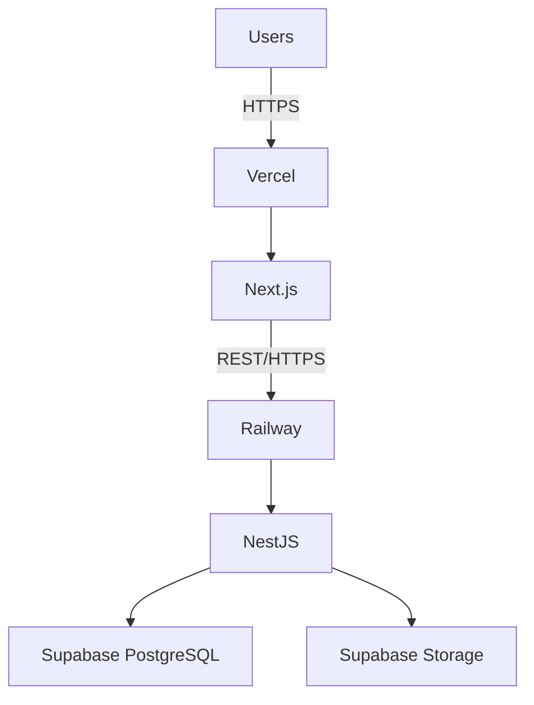

# Technology Stack



| Layer | Technology | Status |
|---|---|---|
| Frontend | Next.js, React, TypeScript, App Router | **Implemented** (`apps/web`) |
| Frontend deployment | Vercel | Planned |
| Backend | NestJS, TypeScript, REST API | Planned (`apps/api` placeholder only) |
| Backend deployment | Railway | Planned |
| Database | PostgreSQL | Planned |
| DB/infra platform | Supabase | Planned |
| Media storage | Supabase Storage | Planned |
| ORM | Prisma | Planned |
| API docs | Swagger / OpenAPI | Planned |
| API communication | REST over HTTPS | Planned |

Final hosting, analytics, and third-party service choices beyond the above remain
**TBC** per the SRS (§9).

## Architectural Boundary

```text
Next.js → NestJS API → PostgreSQL / Supabase
```

Never `Browser → PostgreSQL`. Privileged Supabase credentials stay server-side. See
[Security](security.md).
